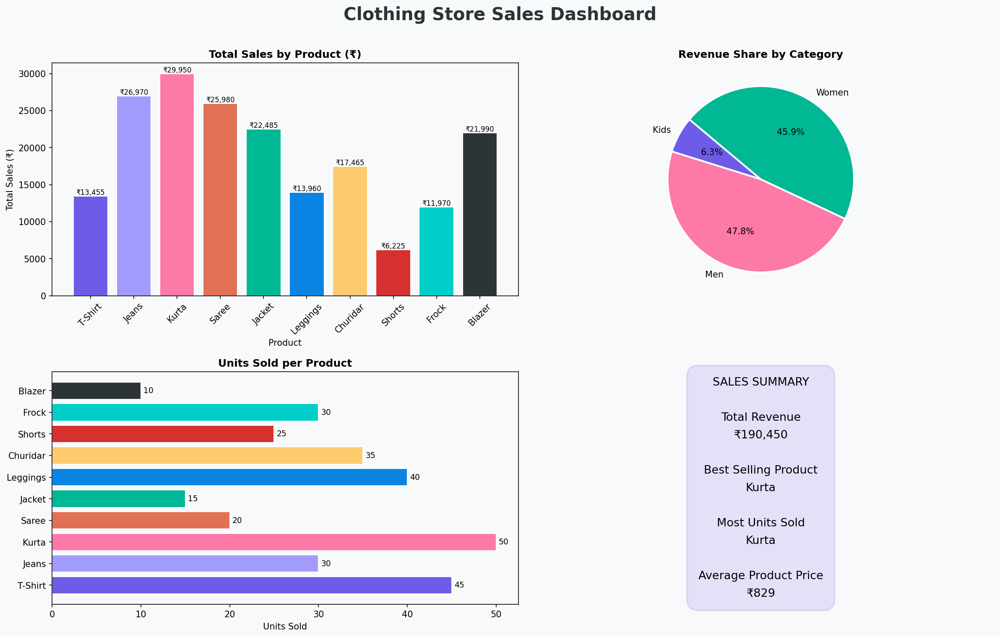

# 👕 Clothing Store Sales Dashboard

A data analysis and visualization project built using Python, Pandas, and Matplotlib.

## 📊 Dashboard Preview


## 🔍 What This Project Does
- Analyzes sales data of 10 clothing products
- Calculates total revenue, best selling product, and units sold
- Visualizes data using 3 charts and a summary card

## 📈 Key Insights
- **Best Selling Product:** Kurta (highest total sales)
- **Most Units Sold:** Kurta (50 units)
- **Top Category:** Men's wear (47.8% revenue share)
- **Total Revenue:** ₹1,82,145

## 🛠️ Tools Used
| Tool | Purpose |
|------|---------|
| Python | Core programming |
| Pandas | Data creation and cleaning |
| Matplotlib | Charts and dashboard |

## 📁 Files
| File | Description |
|------|-------------|
| `clothing_analyzer.py` | Main Python code |
| `clothing_dashboard_v2.png` | Final dashboard image |

## 🚀 How to Run
```bash
pip install pandas matplotlib
python clothing_analyzer.py
```

## 👨‍💻 Author
**Michael Raj** — B.Sc Computer Science with Data Analytics  
Kongunadu Arts and Science College, Coimbatore
